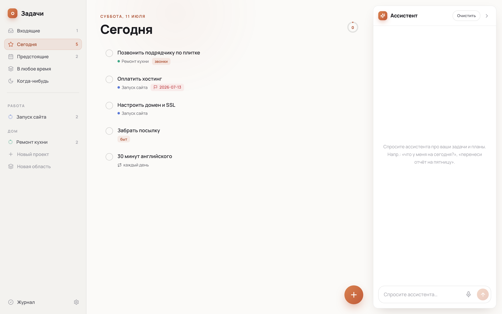
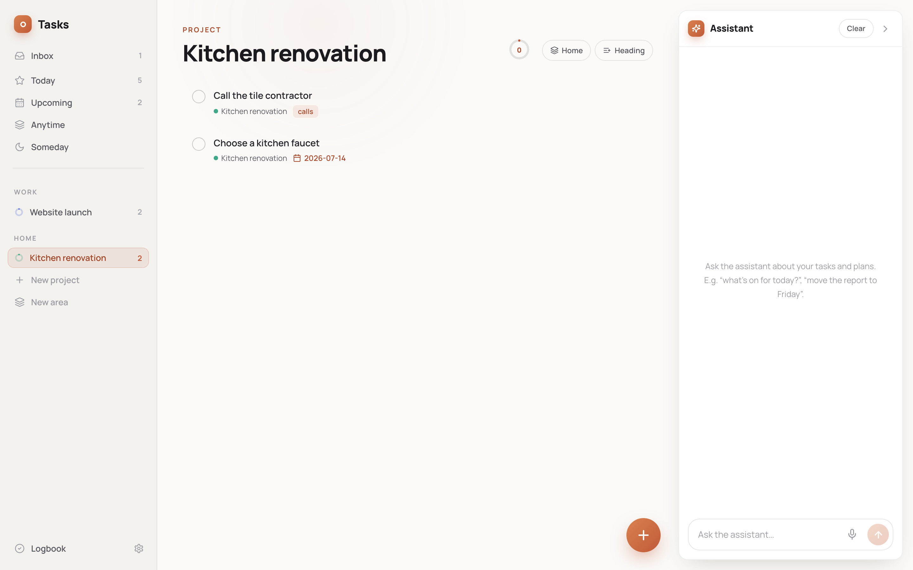
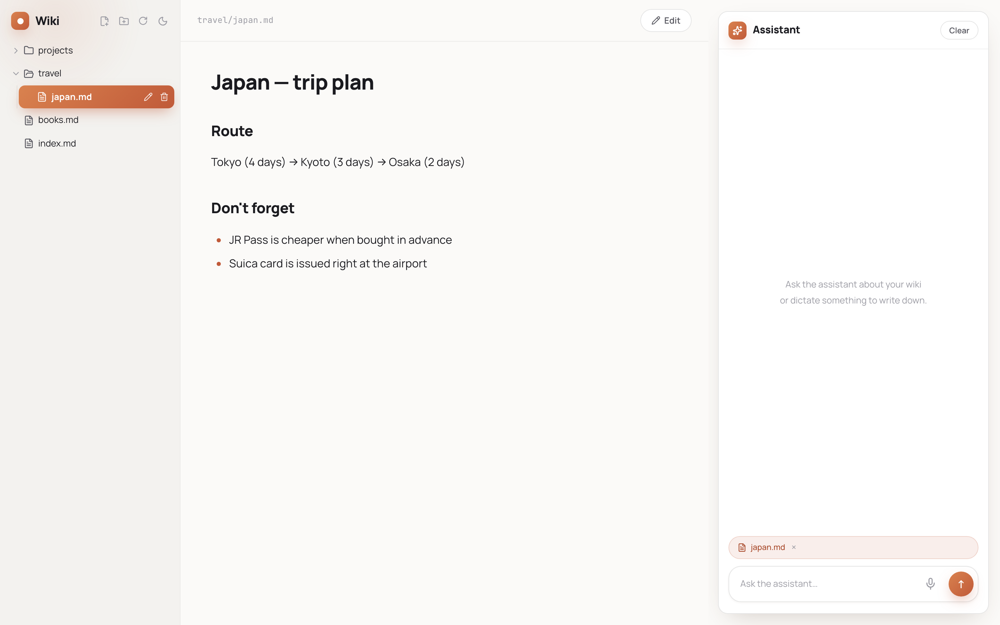

# Bender

**English** | [Русский](README.ru.md)

A self-hosted personal AI agent: a markdown wiki, a Things-style task manager, and a universal assistant in Telegram — all driven by a single agent built on the [Claude Agent SDK](https://docs.anthropic.com/en/api/agent-sdk/overview). Runs on your Claude subscription (OAuth via Claude CLI), no API keys required.



## Features

- **Tasks** — Things-style mechanics: Inbox / Today / Upcoming / Someday, projects and areas, tags, deadlines, checklists, repeating tasks, logbook, drag-and-drop, hotkeys, PWA. Live sync over SSE — changes made from Telegram or by scheduled jobs appear on screen by themselves.
- **Wiki** — a personal knowledge base of markdown files. The agent reads and writes pages, cross-links them, and keeps things tidy.
- **Files** — a personal file storage: plain folders on disk, browsable from the wiki UI (upload, preview, drag-and-drop). Send a document to the Telegram bot — it lands in the inbox folder, gets a human name, and the agent files it into the right folder; ask for a file and the bot sends it back. Wiki pages link to files with `[name](<storage:Folder/file.pdf>)`. Deletes go to a trash folder, not oblivion.
- **Two UI languages** — English and Russian: switchable in Tasks settings; the wiki follows the browser language.
- **Assistant everywhere** — web chat in both UIs plus a Telegram bot sharing one session: whatever you discussed on the web, it remembers in Telegram. Voice messages via ASR. Replies stream in Telegram through the native `sendMessageDraft`.
- **Scheduling** — "remind me in 20 minutes", "send my tasks every weekday at 8:30": the agent creates cron jobs itself. Every run sees the outputs of previous runs (no repeating itself), stays quiet when there is nothing new (`[SILENT]`), and stops the job once the tracked event is over (`[FINAL]`).
- **Memory & self-improvement** — long-term memory about the user (survives session resets), self-authored skills, a background reviewer after every turn (decides what to persist), a weekly skill-library curator, and a session freshness window.
- **Subagents** — researcher (web research) and librarian (wiki reorganization) via Task.

| Dark theme & palettes | Project with logbook |
|---|---|
|  |  |



## Architecture

```
backend/          FastAPI + claude-agent-sdk (single process)
  app/agent.py      sessions, streaming, memory snapshot, freshness window
  app/scheduler.py  cron ticker (60s), [SILENT]/[FINAL], run history
  app/reviewer.py   background post-turn reviewer (memory/skills)
  app/telegram.py   bot: long polling, draft streaming, /status
  app/tasks_*.py    Things mechanics on SQLite (+SSE)
  agent_skills/     the agent's domain skills (wiki/tasks)
frontend-wiki/    React: three panes, markdown, chat
frontend-tasks/   React: tasks, dnd-kit, themes & palettes, chat
```

Storage is files and SQLite on a volume: `content/` (markdown wiki), `data/` (tasks, cron, memory, skills, session) and `files/` (personal file storage). None of it is in the repository — that's personal data.

## Quick start

You need Docker and an authenticated [Claude CLI](https://docs.anthropic.com/en/docs/claude-code) (the agent uses its OAuth credentials from `~/.claude`).

```bash
git clone https://github.com/0717376/bender && cd bender

cat > .env <<'ENV'
WIKI_PASSWORD=pick-a-password
CLAUDE_MODEL=sonnet
# Telegram (optional): bot token and your chat id
TELEGRAM_BOT_TOKEN=
TELEGRAM_ALLOWED_IDS=
ENV

docker compose up -d --build
```

- Tasks: http://localhost:8851
- Wiki: http://localhost:8842

The first message to the Telegram bot will tell you your ID — put it into `TELEGRAM_ALLOWED_IDS` and restart the backend.

### Large files in Telegram (optional)

The cloud Bot API caps files at 20 MB down / 50 MB up. The bundled `tgapi` service (official self-hosted [telegram-bot-api](https://github.com/tdlib/telegram-bot-api)) lifts both limits to 2 GB. To enable it:

1. Get an `api_id` / `api_hash` at [my.telegram.org](https://my.telegram.org) → API development tools (any app name; these identify an "application", they do not grant access to your account).
2. Add to `.env`:
   ```
   TELEGRAM_API_ID=...
   TELEGRAM_API_HASH=...
   TG_API_BASE=http://tgapi:8081
   ```
3. Log the bot out of the cloud (one-off, reversible): `curl https://api.telegram.org/bot<TOKEN>/logOut`
4. `docker compose up -d --build tgapi backend`

The backend detects the local server via `TG_API_BASE` and reads incoming files straight from the shared `tg-bot-api/` volume instead of re-downloading them over HTTP. Leave the variables unset and everything keeps working through the cloud API.

### Environment variables

| Variable | Default | Purpose |
|---|---|---|
| `WIKI_PASSWORD` | — | web UI password (required) |
| `CLAUDE_MODEL` | `sonnet` | agent model (`sonnet`/`opus`/`haiku`) |
| `TELEGRAM_BOT_TOKEN` | — | bot token; empty disables the bot |
| `TELEGRAM_ALLOWED_IDS` | — | comma-separated chat ids |
| `TG_API_BASE` | `https://api.telegram.org` | local bot-api server URL (see above) |
| `TELEGRAM_API_ID` / `TELEGRAM_API_HASH` | — | my.telegram.org keys for the `tgapi` service |
| `FILES_MAX_UPLOAD` | `524288000` | web upload size limit, bytes |
| `ASR_UPSTREAM` | — | speech-to-text service URL for voice messages |
| `ASR_MODEL` | `gigaam-rnnt` | model_id passed to the ASR service |
| `SESSION_FRESH_HOURS` | `6` | idle time after which a fresh session starts |
| `REVIEWER_ENABLED` / `REVIEWER_MODEL` | `1` / `sonnet` | background memory/skills reviewer |
| `CURATOR_ENABLED` / `CURATOR_INTERVAL_HOURS` | `1` / `168` | skill-library curator |
| `CLAUDE_DIR` / `CLAUDE_JSON` | `~/.claude` / `~/.claude.json` | Claude CLI credentials mounted into the container |
| `WIKI_PORT` / `TASKS_PORT` | `8842` / `8851` | frontend ports |
| `TZ` | `Europe/Moscow` | timezone (matters for cron) |

## License

MIT
