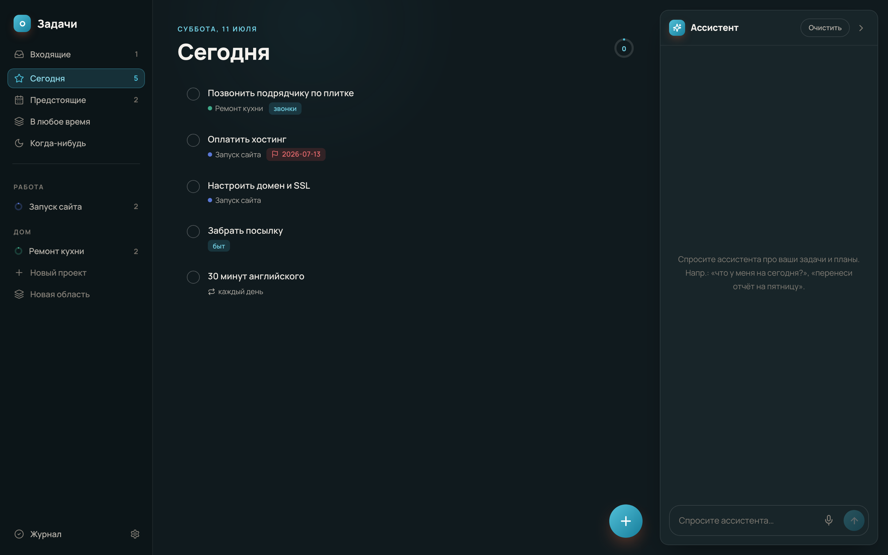
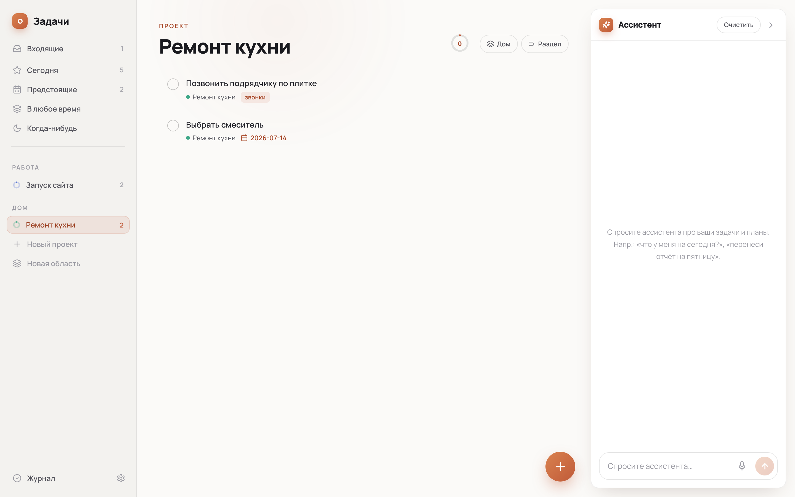
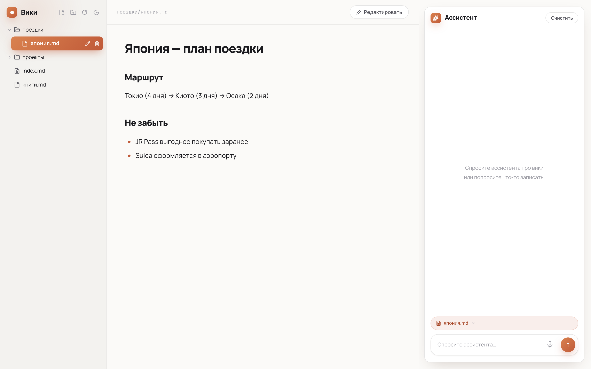

# Bender

[English](README.md) | **Русский**

Личный ИИ-агент на своём железе: вики-заметки, менеджер задач в духе Things и универсальный ассистент в Telegram — всё поверх одного агента на [Claude Agent SDK](https://docs.anthropic.com/en/api/agent-sdk/overview). Работает на подписке Claude (OAuth через Claude CLI), без API-ключей.


## Что умеет

- **Задачи** — механика Things: Входящие / Сегодня / Предстоящие / Когда-нибудь, проекты и области, теги, дедлайны, чек-листы, повторяющиеся задачи, журнал, drag-and-drop, горячие клавиши, PWA. Живая синхронизация через SSE — правки из Telegram или по расписанию появляются на экране сами.
- **Вики** — личная база знаний в markdown-файлах. Агент читает и пишет страницы, ставит ссылки, наводит порядок.
- **Файлы** — личное файловое хранилище: обычные папки на диске, доступные из интерфейса вики (загрузка, превью, drag-and-drop). Пришлите документ боту в Telegram — он упадёт во «Входящие», получит человеческое имя, и агент разложит его по папкам; попросите файл — бот пришлёт его документом. Со страниц вики файлы линкуются как `[имя](<storage:Папка/файл.pdf>)`. Удаление — в корзину, а не насовсем.
- **Два языка интерфейса** — русский и английский: в Задачах переключается в настройках, Вики следует языку браузера.
- **Ассистент везде** — веб-чат в обоих интерфейсах и Telegram-бот с общей сессией: что обсудили в чате, он помнит и в телеге. Голосовые — через ASR. Стриминг ответов в Telegram через нативный `sendMessageDraft`.
- **Расписание** — «напомни через 20 минут», «каждый будний день в 8:30 пришли задачи»: агент сам заводит cron-задания. Каждый запуск видит выводы предыдущих (не повторяется), молчит, когда нечего сказать (`[SILENT]`), и останавливает задание после финала события (`[FINAL]`).
- **Память и самообучение** — долговременная память о пользователе (переживает сброс сессии), самописные навыки-скиллы, фоновый ревьюер после каждого хода (решает, что сохранить), еженедельный «куратор» библиотеки навыков, окно свежести сессии.
- **Субагенты** — researcher (веб-ресёрч) и librarian (реорганизация вики) через Task.

| Тёмная тема и палитры | Проект с журналом |
|---|---|
|  |  |



## Архитектура

```
backend/          FastAPI + claude-agent-sdk (один процесс)
  app/agent.py      сессии, стриминг, снапшот памяти, окно свежести
  app/scheduler.py  cron-тикер (60с), [SILENT]/[FINAL], история запусков
  app/reviewer.py   фоновый пост-ходовой ревьюер (память/навыки)
  app/telegram.py   бот: long polling, стриминг-черновики, /status
  app/tasks_*.py    Things-механика поверх SQLite (+SSE)
  agent_skills/     доменные навыки агента (wiki/tasks)
frontend-wiki/    React: три панели, markdown, чат
frontend-tasks/   React: задачи, dnd-kit, темы и палитры, чат
```

Хранилище — файлы и SQLite на volume: `content/` (markdown-вики), `data/` (задачи, cron, память, навыки, сессия) и `files/` (файловое хранилище). Ничего из этого в репозитории нет — это личные данные.

## Быстрый старт

Понадобится Docker и авторизованный [Claude CLI](https://docs.anthropic.com/en/docs/claude-code) (агент работает через его OAuth-креды из `~/.claude`).

```bash
git clone https://github.com/0717376/bender && cd bender

cat > .env <<'ENV'
WIKI_PASSWORD=придумайте-пароль
CLAUDE_MODEL=sonnet
# Telegram (необязательно): токен бота и ваш chat id
TELEGRAM_BOT_TOKEN=
TELEGRAM_ALLOWED_IDS=
ENV

docker compose up -d --build
```

- Задачи: http://localhost:8851
- Вики: http://localhost:8842

Первое сообщение боту в Telegram подскажет ваш ID — впишите его в `TELEGRAM_ALLOWED_IDS` и перезапустите backend.

### Большие файлы в Telegram (опционально)

Облачный Bot API режет файлы: 20 МБ на приём, 50 МБ на отправку. Сервис `tgapi` из compose (официальный self-hosted [telegram-bot-api](https://github.com/tdlib/telegram-bot-api)) поднимает оба лимита до 2 ГБ. Включение:

1. Получите `api_id` / `api_hash` на [my.telegram.org](https://my.telegram.org) → API development tools (имя приложения любое; эти ключи идентифицируют «приложение» и не дают доступа к аккаунту).
2. Добавьте в `.env`:
   ```
   TELEGRAM_API_ID=...
   TELEGRAM_API_HASH=...
   TG_API_BASE=http://tgapi:8081
   ```
3. Разово разлогиньте бота из облака (обратимо): `curl https://api.telegram.org/bot<TOKEN>/logOut`
4. `docker compose up -d --build tgapi backend`

Backend определяет локальный сервер по `TG_API_BASE` и читает входящие файлы прямо с общего volume `tg-bot-api/`, не перекачивая их по HTTP. Если переменные не заданы — всё работает через облако, как раньше.

### Переменные окружения

| Переменная | По умолчанию | Что делает |
|---|---|---|
| `WIKI_PASSWORD` | — | пароль веб-интерфейсов (обязателен) |
| `CLAUDE_MODEL` | `sonnet` | модель агента (`sonnet`/`opus`/`haiku`) |
| `TELEGRAM_BOT_TOKEN` | — | токен бота; пусто — бот выключен |
| `TELEGRAM_ALLOWED_IDS` | — | список chat id через запятую |
| `TG_API_BASE` | `https://api.telegram.org` | адрес локального bot-api сервера (см. выше) |
| `TELEGRAM_API_ID` / `TELEGRAM_API_HASH` | — | ключи my.telegram.org для сервиса `tgapi` |
| `FILES_MAX_UPLOAD` | `524288000` | лимит веб-загрузки, байт |
| `ASR_UPSTREAM` | — | URL сервиса распознавания речи для голосовых |
| `ASR_MODEL` | `gigaam-rnnt` | model_id, который передаётся ASR-сервису |
| `SESSION_FRESH_HOURS` | `6` | простой, после которого сессия начинается заново |
| `REVIEWER_ENABLED` / `REVIEWER_MODEL` | `1` / `sonnet` | фоновый ревьюер памяти и навыков |
| `CURATOR_ENABLED` / `CURATOR_INTERVAL_HOURS` | `1` / `168` | куратор библиотеки навыков |
| `CLAUDE_DIR` / `CLAUDE_JSON` | `~/.claude` / `~/.claude.json` | креды Claude CLI, монтируются в контейнер |
| `WIKI_PORT` / `TASKS_PORT` | `8842` / `8851` | порты фронтендов |
| `TZ` | `Europe/Moscow` | часовой пояс (важен для cron) |

## Лицензия

MIT
