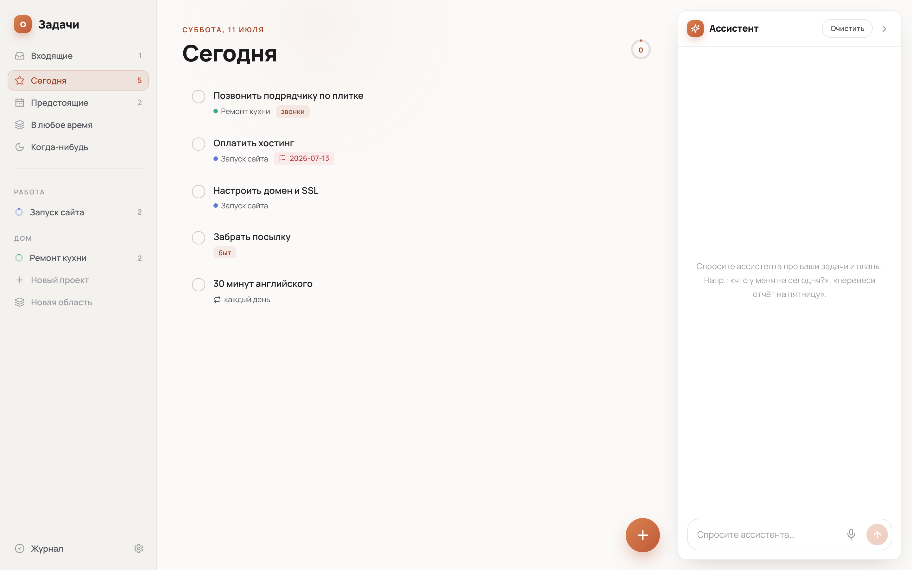
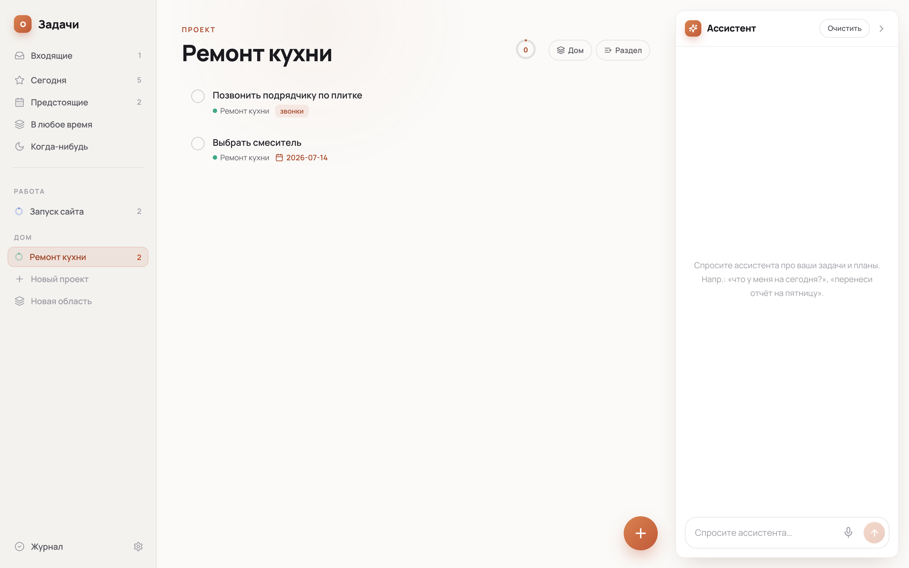
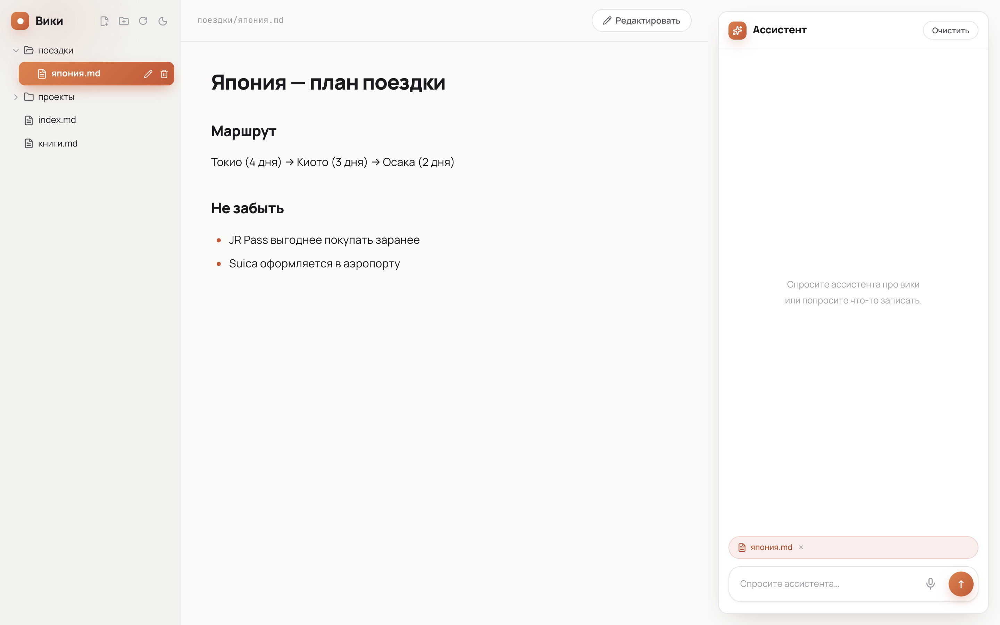
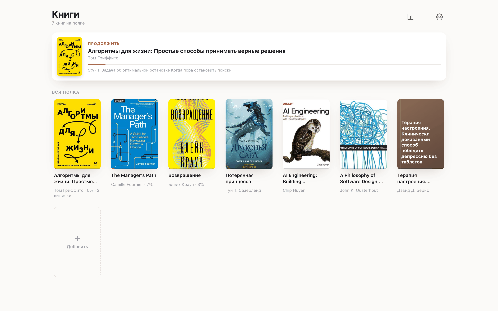
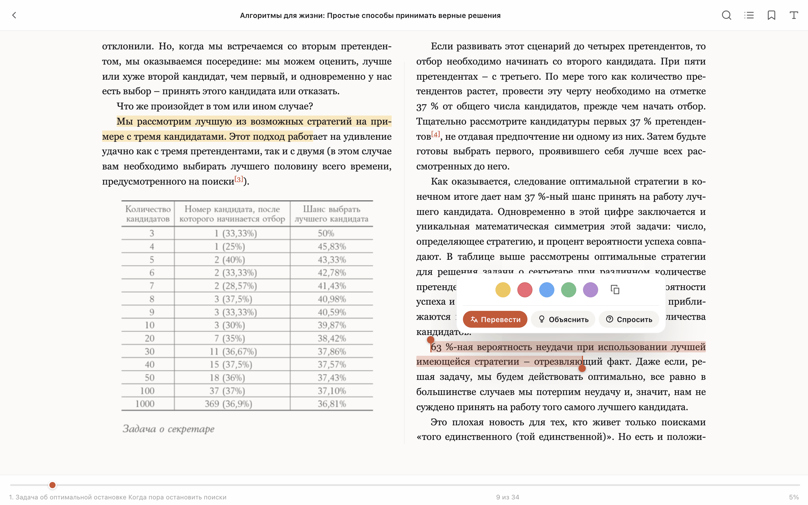

# Bender

[English](README.md) | **Русский**

Личный ИИ-агент на своём железе: вики-заметки, менеджер задач в духе Things и универсальный ассистент в Telegram — всё поверх одного агента. Работает **на подписке, а не на API-ключах**: либо Claude Max через [Claude Agent SDK](https://docs.anthropic.com/en/api/agent-sdk/overview), либо ChatGPT Plus/Pro через [Codex SDK](https://developers.openai.com/codex/sdk). Движок выбирается при установке и переключается одной строкой в `.env`.



## Что умеет

- **Задачи** — механика Things: Входящие / Сегодня / Предстоящие / Когда-нибудь, проекты и области, теги, дедлайны, чек-листы, повторяющиеся задачи (по дням недели, «второй вторник», конец после N раз или по дате — копии раскладываются вперёд и не ждут, пока отметишь предыдущую), журнал, drag-and-drop, горячие клавиши, PWA. Живая синхронизация через SSE — правки из Telegram или по расписанию появляются на экране сами.
- **Вики** — личная база знаний в markdown-файлах. Иерархия страниц как в Confluence: папок нет вовсе, есть только страницы — у любой могут появиться дочерние, и она сама становится родительской (на диске это папка со своим `index.md`, но ни слова «папка», ни слова «index» в интерфейсе нет). Ссылки по имени (`[[litellm]]`), поэтому страница переезжает между родителями бесплатно; обычные ссылки чинятся автоматически при переносе. Удаление — в корзину с отменой. Живая синхронизация через SSE: правки агента, Telegram и внешних MCP-клиентов появляются на экране сами.
- **Файлы** — личное файловое хранилище: обычные папки на диске, доступные из интерфейса вики (загрузка, превью, drag-and-drop). Пришлите документ боту в Telegram — он упадёт во «Входящие», получит человеческое имя, и агент разложит его по папкам; попросите файл — бот пришлёт его документом. Со страниц вики файлы линкуются как `[имя](<storage:Папка/файл.pdf>)`. Удаление — в корзину, а не насовсем.
- **Читалка** — epub и pdf прямо в браузере: полка с обложками и прогрессом, выписки цветом (цвет = смысл: важное, вопрос, не согласен, в вики), закладки, статистика чтения и серия дней. Рядом с текстом — агент, который читает саму книгу: спросите «о чём эта глава» или «переведи абзац», и он ответит по книге, а не по присланному фрагменту. Разговор о каждой книге ведётся своей нитью и не мешает общему.
- **Два языка интерфейса** — русский и английский: Вики следует языку браузера, в Задачах и Читалке переключается в настройках. У Читалки язык интерфейса заодно задаёт язык разбора: у английской — «переведи на английский», у русской — на русский.
- **Ассистент везде** — веб-чат в обоих интерфейсах и Telegram-бот с общей сессией: что обсудили в чате, он помнит и в телеге. У читалки нить своя на каждую книгу — разбор главы не выдавливает общий разговор. Голосовые — через ASR. Стриминг ответов в Telegram через нативный `sendMessageDraft`.
- **Расписание** — «напомни через 20 минут», «каждый будний день в 8:30 пришли задачи»: агент сам заводит cron-задания. Каждый запуск видит выводы предыдущих (не повторяется), молчит, когда нечего сказать (`[SILENT]`), и останавливает задание после финала события (`[FINAL]`).
- **Память и самообучение** — долговременная память о пользователе (переживает сброс сессии), самописные навыки-скиллы, фоновый ревьюер после каждого хода (решает, что сохранить), еженедельный «куратор» библиотеки навыков, окно свежести сессии.
- **Субагенты** — researcher (веб-ресёрч) и librarian (реорганизация вики) через Task (движок Claude).
- **Две подписки на выбор** — Claude Max или ChatGPT Plus/Pro. Вики, задачи, книги, память, крон, навыки и запреты одинаковы на обоих: инструменты описаны один раз, а движок получает их своим способом.

| Тёмная тема и палитры | Проект с журналом |
|---|---|
|  |  |



| Полка: обложки, прогресс, выписки | Чтение: выделение цветом и агент по книге |
|---|---|
|  |  |

## Архитектура

```
backend/          FastAPI + движок агента (один процесс)
  app/agent.py      сессии, стриминг, снапшот памяти, окно свежести
  app/engines/      claude.py и codex.py: один ход разговора, общий поток событий
  app/tool_registry.py  единый список доменных инструментов на оба движка
  app/mcp_internal.py   те же инструменты по HTTP — так их видит Codex
  app/scheduler.py  cron-тикер (60с), [SILENT]/[FINAL], история запусков
  app/reviewer.py   фоновый пост-ходовой ревьюер (память/навыки)
  app/telegram.py   бот: long polling, стриминг-черновики, /status
  app/tasks_*.py    Things-механика поверх SQLite (+SSE)
  app/books_*.py    библиотека epub: разбор, выписки, книга целиком для агента
  agent_skills/     доменные навыки агента (wiki/tasks/books)
frontend-wiki/    React: три панели, markdown, чат
frontend-tasks/   React: задачи, dnd-kit, темы и палитры, чат
frontend-books/   читалка epub: полка, выделения, агент по книге (PWA, без фреймворка)
install.sh        мастер установки: вопросы, .env, образы, проверка
bender            эксплуатация: doctor / update / rollback / pair / login / token / logs
```

Хранилище — файлы и SQLite на volume: `content/` (markdown-вики), `data/` (задачи, cron, память, навыки, сессия), `files/` (файловое хранилище) и `books/` (библиотека читалки: epub, обложки, текст глав). Ничего из этого в репозитории нет — это личные данные.

## Быстрый старт

Понадобится Docker. Больше ничего.

```bash
git clone https://github.com/0717376/bender && cd bender
./install.sh
```

Установщик спросит, на какой подписке работать (Claude Max или ChatGPT), задаст несколько
вопросов (пароль от веба, модель, таймзона, бот в Telegram — по желанию), разберётся с
авторизацией, скачает образы, поднимет стенд и проверит его по-настоящему: отвечает ли
бэкенд, авторизован ли агент, на связи ли бот. В Codex вход идёт по коду устройства —
браузер нужен любой, но не на этой машине, так что годится и голая виртуалка по ssh.
В конце напечатает адреса:

- Задачи: http://localhost:8851
- Вики: http://localhost:8842
- Книги: http://localhost:8899 (полку наполняете сами — книги живут в `books/`, в репозитории их нет)

Telegram привязывается шестизначным кодом, который печатает установщик: отправьте код
своему боту — и чат привязан, без правки конфига и перезапуска.

Дальше:

```bash
./bender doctor   # контейнеры, авторизация, бот, порты, диск — по строке на проверку
./bender update   # git pull, свежие образы, перезапуск, проверка
./bender login    # войти в ChatGPT по коду устройства (движок codex)
```

Авторизация на сервере без браузера, свой bot-api для файлов до 2 ГБ, все переменные
окружения, установка руками: [docs/configuration.ru.md](docs/configuration.ru.md).

## Лицензия

MIT
